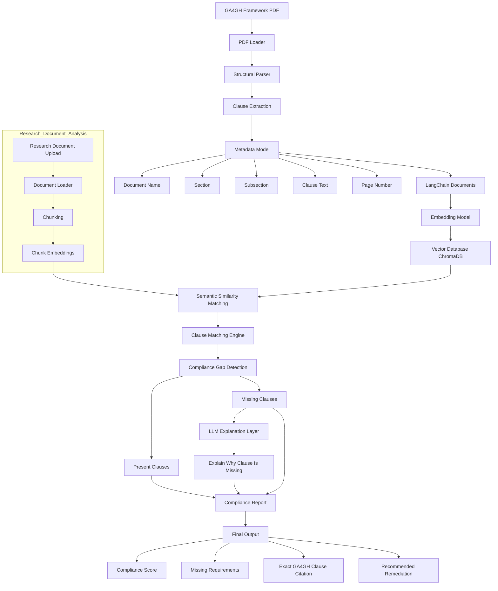

run with this command:-

pip install -r requirements.txt

python main.py

## System Architecture

```mermaid
flowchart TD

A[GA4GH Framework PDF] --> B[PDF Loader]
B --> C[Structural Parser]

C --> D[Clause Extraction]

D --> E[Metadata Model]

E --> F[Document Name]
E --> G[Section]
E --> H[Subsection]
E --> I[Clause Text]
E --> J[Page Number]

E --> K[LangChain Documents]

K --> L[Embedding Model]

L --> M[Vector Database ChromaDB]

subgraph Research_Document_Analysis
    N[Research Document Upload] --> O[Document Loader]
    O --> P[Chunking]
    P --> Q[Chunk Embeddings]
end

Q --> R[Semantic Similarity Matching]

M --> R

R --> S[Clause Matching Engine]

S --> T[Compliance Gap Detection]

T --> U[Present Clauses]
T --> V[Missing Clauses]

V --> W[LLM Explanation Layer]

W --> X[Explain Why Clause Is Missing]

U --> Y[Compliance Report]
X --> Y
V --> Y

Y --> Z[Final Output]

Z --> Z1[Compliance Score]
Z --> Z2[Missing Requirements]
Z --> Z3[Exact GA4GH Clause Citation]
Z --> Z4[Recommended Remediation]
```